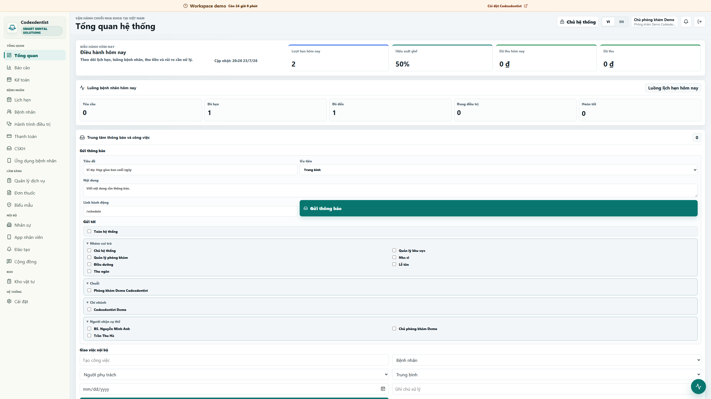
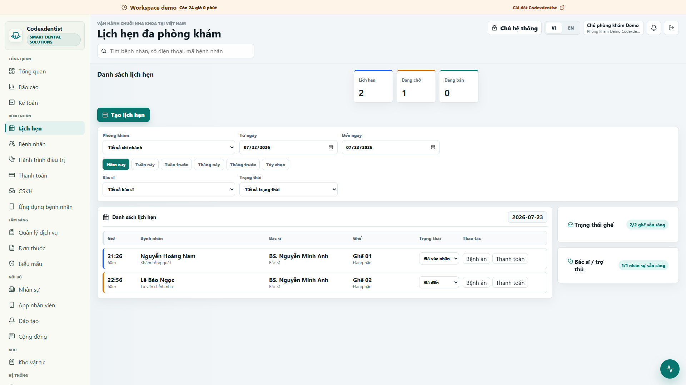
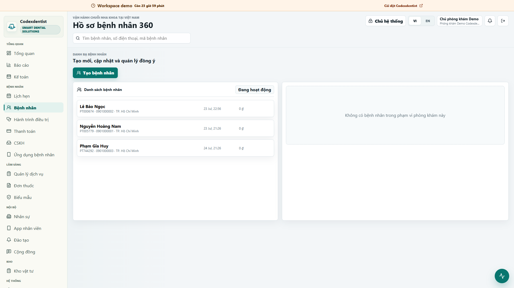
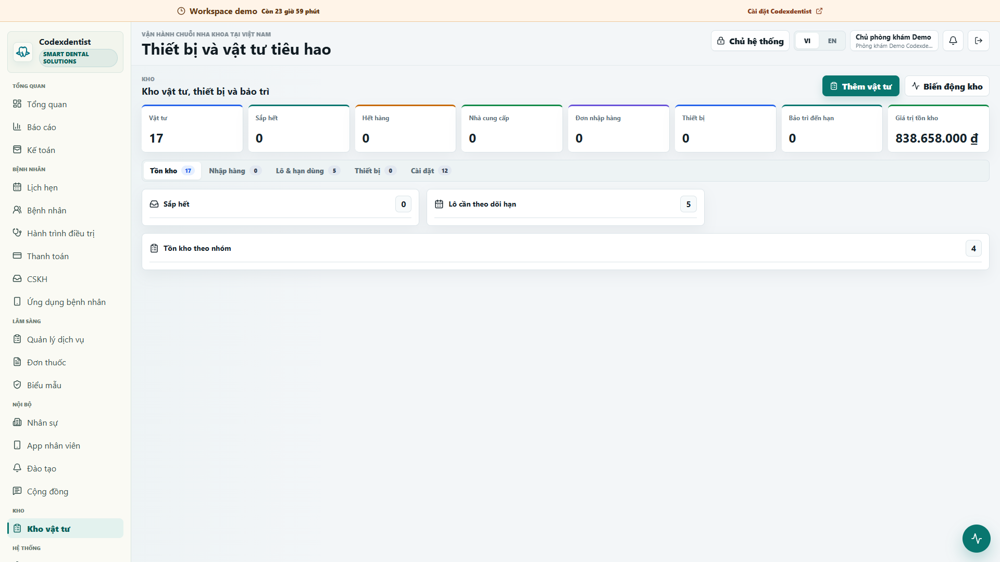

# Codexdentist

[Tiếng Việt](#tiếng-việt) | [English](#english)

Codexdentist là phần mềm mã nguồn mở để vận hành phòng khám nha khoa vừa và nhỏ. Hệ thống tập trung lịch hẹn, hồ sơ bệnh nhân, điều trị, thanh toán, kho, nhân sự, CRM, biểu mẫu và báo cáo trong một ứng dụng đa phòng khám.



## Tiếng Việt

### Dùng thử và tìm hiểu

- Website: [codexdentist.com](https://codexdentist.com)
- Demo đầy đủ trong 24 giờ: [demo.codexdentist.com](https://demo.codexdentist.com)
- Hướng dẫn tính năng: [codexdentist.com/features](https://codexdentist.com/features)
- Hướng dẫn cài đặt: [codexdentist.com/docs](https://codexdentist.com/docs)

Mỗi lượt demo dùng một phòng khám tách biệt và sẽ tự hết hạn. Không nhập dữ liệu bệnh nhân thật vào bản demo.

| Lịch hẹn | Hồ sơ bệnh nhân |
| --- | --- |
|  |  |



### Tự cài đặt

Windows cần Windows 10/11 64-bit, WSL 2, Node.js 22 LTS, Docker Desktop có Compose, tối thiểu 8 GB RAM và 20 GB dung lượng trống. Linux/NAS có thể bắt đầu từ 4 GB RAM và 10 GB trống, nhưng khuyến nghị 8 GB RAM.

Windows:

```powershell
git clone https://github.com/vudatdentist-ui/codexdentist.git
cd codexdentist
.\install.ps1
```

Linux hoặc macOS:

```bash
git clone https://github.com/vudatdentist-ui/codexdentist.git
cd codexdentist
chmod +x install.sh
./install.sh
```

Installer tự tạo `.env.selfhost` với khóa ngẫu nhiên, build ứng dụng, chạy PostgreSQL, áp dụng migration và in địa chỉ truy cập trong mạng LAN. Mở `http://127.0.0.1:3000/setup` trên máy chủ để tạo phòng khám và tài khoản Chủ hệ thống đầu tiên.

Nếu cổng 3000 đã được dùng, đặt cổng khác trước khi cài: `$env:CODEXDENTIST_PORT="3317"` trên PowerShell hoặc `CODEXDENTIST_PORT=3317 ./install.sh` trên Linux/macOS.

### Vận hành

```bash
npm run codexdentist -- start
npm run codexdentist -- stop
npm run codexdentist -- status
npm run codexdentist -- doctor
npm run codexdentist -- backup
npm run codexdentist -- restore backups/<folder> --confirm
npm run codexdentist -- update
```

Backup gồm bản sao PostgreSQL và kho tệp bệnh nhân. Luôn giữ thêm một bản ngoài máy chủ phòng khám và thử khôi phục trước khi dùng dữ liệu thật. Cấu hình chi tiết nằm trong [docs/OPERATIONS.md](docs/OPERATIONS.md).

### Phát triển và đóng góp

```bash
docker compose up -d
npm install
npm run prisma:generate
npm run prisma:migrate
npm run dev
```

Mở `http://127.0.0.1:3000`. Trước khi gửi thay đổi:

```bash
npm run encoding:check
npm run typecheck
npm run build
```

Đọc [CONTRIBUTING.md](CONTRIBUTING.md) trước khi tạo pull request. Không đưa thông tin đăng nhập, database dump, dữ liệu bệnh nhân thật hoặc ảnh chụp phòng khám thật lên issue hay pull request.

## English

Codexdentist is an open-source operating system for small and medium dental clinics in Viet Nam. It combines scheduling, patient records, clinical journeys, billing, inventory, staff operations, CRM, forms, and reporting in one multi-tenant application.

### Try it

- Product: [codexdentist.com](https://codexdentist.com)
- Isolated 24-hour demo: [demo.codexdentist.com](https://demo.codexdentist.com)
- Feature guide: [codexdentist.com/features](https://codexdentist.com/features)
- Installation guide: [codexdentist.com/docs](https://codexdentist.com/docs)

Do not enter real patient information into the public demo.

### Self-host

Windows requires 64-bit Windows 10/11, WSL 2, Node.js 22 LTS, Docker Desktop with Compose, at least 8 GB RAM, and 20 GB of free disk space. Linux/NAS can start with 4 GB RAM and 10 GB free, but 8 GB RAM is recommended.

Use `.\install.ps1` on Windows or `./install.sh` on Linux/macOS. The installer generates random secrets, builds the application, starts PostgreSQL, applies migrations, and prints local and LAN addresses. Open `/setup` to create the first clinic and owner.

See [docs/OPERATIONS.md](docs/OPERATIONS.md) for backup, restore, update, production, and go-live procedures.

### Architecture and safety

- PostgreSQL is the canonical data store.
- Operational data is scoped by `organizationId`; clinic data also respects accessible clinic IDs.
- Permissions are enforced in server loaders and actions.
- Patient files are protected records, never public assets.
- Hosted deployments require HTTPS, private R2 storage, strong secrets, and external backups.
- Self-hosted deployments may use protected local volumes.

Engineering context is kept in [AGENTS.md](AGENTS.md), [docs/PROJECT_CONTEXT.md](docs/PROJECT_CONTEXT.md), and [docs/QA_PLAYBOOK.md](docs/QA_PLAYBOOK.md).

## License

Codexdentist is licensed under the GNU Affero General Public License v3.0 or later (`AGPL-3.0-or-later`). See [LICENSE](LICENSE).
